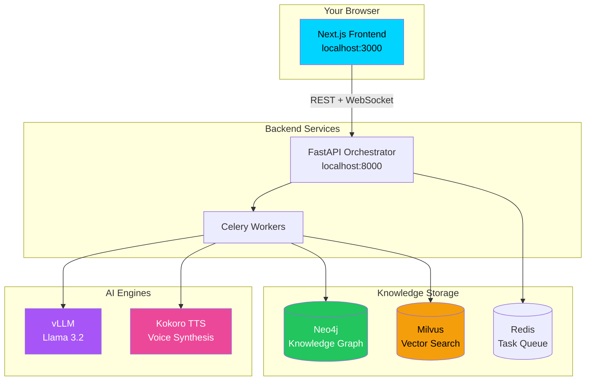

# 🧠 Local Mind

> **Your Personal AI Research Assistant — Fully Local, Fully Private**

Transform your documents into an intelligent knowledge base with AI-powered search, interactive knowledge graphs, and podcast-style audio summaries. No cloud. No API keys. Everything runs on YOUR hardware.


---

## ⚡ One-Command Start

```bash
# Clone the repository
git clone https://github.com/your-org/local-mind.git
cd local-mind

# Copy environment file
cp .env.example .env

# Start everything with a single command
sh scripts/init.sh
```


That's it. Open **http://localhost:3000** when it's ready.

---

## 🕐 The First Run (Be Patient!)

> **⚠️ Important:** The first startup takes **10-15 minutes** to download AI model weights.

| What's Downloading | Size | Purpose |
|-------------------|------|---------|
| Llama 3.2 (8B) | ~8 GB | Text understanding & generation |
| Kokoro TTS | ~2 GB | Natural voice synthesis |
| Embedding Model | ~500 MB | Document understanding |
| Neo4j + Milvus | ~3 GB | Graph & vector databases |

### What to Expect

```
[ 1 min  ] 🐳 Pulling container images...
[ 5 min  ] 📥 Downloading Llama 3.2 weights...
[ 3 min  ] 🎙️ Downloading Kokoro TTS model...
[ 2 min  ] 🔧 Initializing databases...
[ READY  ] ✅ Open http://localhost:3000
```

**Pro tip:** Subsequent starts take only ~30 seconds since models are cached.

---

## 🏗️ Architecture



### How Data Flows

1. **Upload** → PDFs are chunked and embedded
2. **GraphRAG** → Entities extracted, relationships mapped to Neo4j
3. **Search** → Hybrid vector + graph retrieval with RRF fusion
4. **Podcast** → LLM scripts dialogue → TTS generates audio
5. **Stream** → WebSocket delivers audio in real-time

---

## 💾 VRAM Troubleshooting

> **Don't have enough GPU memory?** Adjust these settings in your `.env` file:

| Your GPU | VRAM | Recommended Settings |
|----------|------|---------------------|
| RTX 3060 Ti | 8 GB | `QUANTIZATION=4bit`<br/>`CONTEXT_WINDOW=2048`<br/>`TTS_ENABLED=false` |
| RTX 3080 | 10 GB | `QUANTIZATION=4bit`<br/>`CONTEXT_WINDOW=4096`<br/>`TTS_ENABLED=true` |
| RTX 3090 / 4080 | 12 GB | `QUANTIZATION=4bit`<br/>`CONTEXT_WINDOW=4096`<br/>`TTS_ENABLED=true` |
| RTX 4090 | 24 GB | `QUANTIZATION=8bit`<br/>`CONTEXT_WINDOW=8192`<br/>`TTS_ENABLED=true` |
| A100 / H100 | 40+ GB | `QUANTIZATION=none`<br/>`CONTEXT_WINDOW=16384`<br/>`TTS_ENABLED=true` |

### How to Apply Settings

```bash
# Edit your environment file
nano infrastructure/nerdctl/.env

# Add/modify these lines:
QUANTIZATION=4bit
CONTEXT_WINDOW=4096
TTS_ENABLED=true

# Restart the stack
nerdctl compose down && nerdctl compose up -d
```

### "CUDA Out of Memory" Error?

If you see `CUDA OOM` errors:

1. **Reduce context window:** `CONTEXT_WINDOW=2048`
2. **Enable 4-bit quantization:** `QUANTIZATION=4bit`
3. **Disable TTS temporarily:** `TTS_ENABLED=false`
4. **Check other GPU processes:** `nvidia-smi`

---

## 🛠️ Prerequisites

### Required
- **NVIDIA GPU** with 12GB+ VRAM (8GB works with 4-bit quantization)
- **NVIDIA Container Toolkit** ([installation guide](https://docs.nvidia.com/datacenter/cloud-native/container-toolkit/install-guide.html))
- **nerdctl + containerd** (or Docker with GPU support)
- **16GB+ RAM**
- **50GB free disk space** (for models + data)

### Installing nerdctl (WSL2/Linux)

```bash
# On Ubuntu/Debian
curl -fsSL https://github.com/containerd/nerdctl/releases/download/v1.7.0/nerdctl-1.7.0-linux-amd64.tar.gz | sudo tar -xzf - -C /usr/local/bin

# Verify GPU passthrough
nerdctl run --rm --gpus all nvidia/cuda:12.0-base-ubuntu22.04 nvidia-smi
```

---

## 📁 Project Structure

```
sovereign-cognitive-engine/
├── apps/
│   ├── backend/           # FastAPI + Celery (Python)
│   │   ├── services/      # GraphRAG, LLM, TTS services
│   │   └── main.py        # API endpoints
│   └── frontend/          # Next.js 15 (TypeScript)
│       ├── components/    # React components
│       └── store/         # Zustand state
├── infrastructure/
│   ├── nerdctl/           # Container orchestration
│   │   ├── compose.yaml   # Service definitions
│   │   └── .env.example   # Configuration template
│   └── tuning_config.py   # Auto-optimization
├── scripts/
│   ├── init.sh            # One-command start
│   └── watchdog.sh        # Self-healing monitor
└── tests/
    ├── unit/              # Schema & algorithm tests
    ├── integration/       # Mocked service tests
    └── stress/            # Chaos testing (Locust)
```

---

## 🎯 Features

### 📄 Document Intelligence
- Drag-and-drop PDF/TXT upload
- Automatic chunking and embedding
- Entity extraction with local LLM

### 🕸️ Knowledge Graph
- Interactive 3D visualization
- Entity relationships mapped automatically
- Click-to-focus "Director Mode"

### 💬 AI Chat
- RAG-powered answers from YOUR documents
- Citations linked to source paragraphs
- Hybrid search (vector + graph)

### 🎙️ Podcast Generation
- Two AI hosts (Alex & Sarah) discuss your content
- Natural dialogue with personality
- Real-time audio streaming

---

## 🔧 Common Commands

```bash
# Start all services
sh scripts/init.sh

# View logs
nerdctl compose -f infrastructure/nerdctl/compose.yaml logs -f

# Stop everything
nerdctl compose -f infrastructure/nerdctl/compose.yaml down

# Check GPU usage
nvidia-smi -l 1

# Run stress tests
cd tests && locust -f stress/chaos.py --host=http://localhost:8000

# Start watchdog (auto-heals crashed services)
nohup ./scripts/watchdog.sh &
```

---

## 🐛 Troubleshooting

<details>
<summary><strong>❌ "nerdctl: command not found"</strong></summary>

Install nerdctl:
```bash
curl -fsSL https://github.com/containerd/nerdctl/releases/download/v1.7.0/nerdctl-1.7.0-linux-amd64.tar.gz | sudo tar -xzf - -C /usr/local/bin
```
</details>

<details>
<summary><strong>❌ "GPU not detected"</strong></summary>

1. Install NVIDIA Container Toolkit:
```bash
distribution=$(. /etc/os-release;echo $ID$VERSION_ID)
curl -s -L https://nvidia.github.io/libnvidia-container/gpgkey | sudo apt-key add -
curl -s -L https://nvidia.github.io/libnvidia-container/$distribution/libnvidia-container.list | sudo tee /etc/apt/sources.list.d/nvidia-container-toolkit.list
sudo apt-get update && sudo apt-get install -y nvidia-container-toolkit
sudo systemctl restart containerd
```

2. Test GPU access:
```bash
nerdctl run --rm --gpus all nvidia/cuda:12.0-base-ubuntu22.04 nvidia-smi
```
</details>

<details>
<summary><strong>❌ "Port 3000 already in use"</strong></summary>

```bash
# Find what's using the port
lsof -i :3000

# Kill it or change port in compose.yaml
kill -9 <PID>
```
</details>

<details>
<summary><strong>❌ Models downloading too slowly</strong></summary>

Models are cached after first download. If you have a slow connection:

1. Download models manually from HuggingFace
2. Mount them at `~/.cache/huggingface`

```bash
# Pre-download Llama
huggingface-cli download meta-llama/Llama-3.2-8B-Instruct --local-dir ~/.cache/huggingface/llama
```
</details>

---

## 📝 Environment Variables

| Variable | Default | Description |
|----------|---------|-------------|
| `LLM_MODEL` | `meta-llama/Llama-3.2-8B-Instruct` | HuggingFace model ID |
| `QUANTIZATION` | `none` | `none`, `4bit`, `8bit` |
| `CONTEXT_WINDOW` | `8192` | Max tokens per request |
| `TTS_ENABLED` | `true` | Enable voice synthesis |
| `NEO4J_PASSWORD` | `localmind2024` | Graph database password |
| `GPU_MEMORY_UTILIZATION` | `0.7` | % of VRAM for LLM (leave room for TTS) |

---

## 🤝 Contributing

1. Fork the repository
2. Create your feature branch (`git checkout -b feature/amazing`)
3. Run tests (`pytest tests/`)
4. Commit your changes (`git commit -m 'Add amazing feature'`)
5. Push to the branch (`git push origin feature/amazing`)
6. Open a Pull Request

---

## 📄 License

MIT License - see [LICENSE](LICENSE) for details.

---

<div align="center">

**Built with 🧠 for researchers, by researchers.**

[Report Bug](https://github.com/your-org/local-mind/issues) · [Request Feature](https://github.com/your-org/local-mind/issues)

</div>
