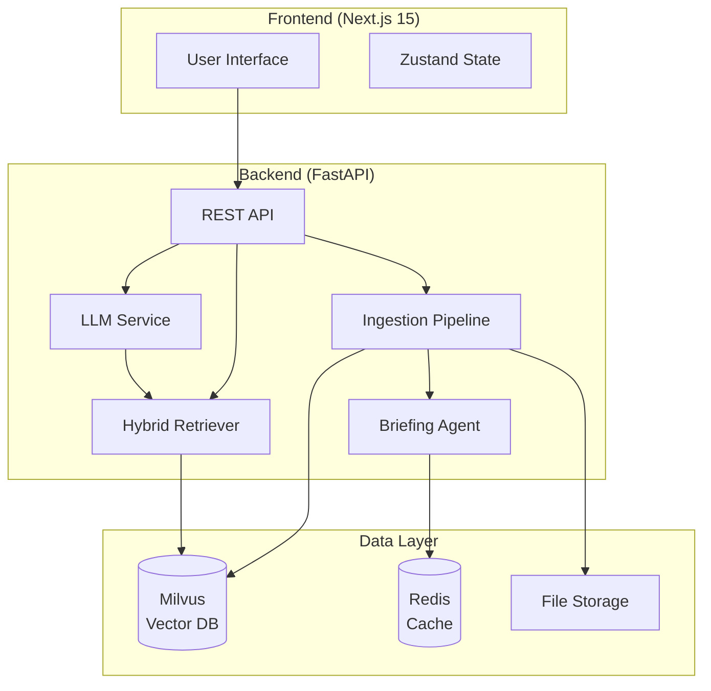
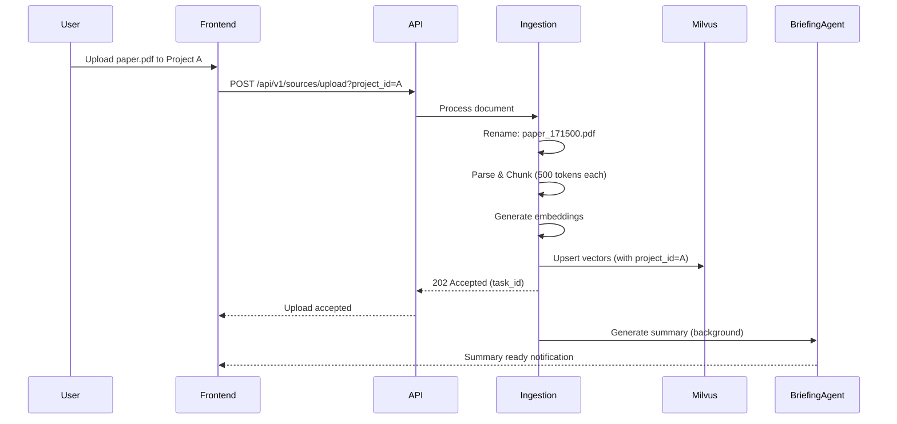
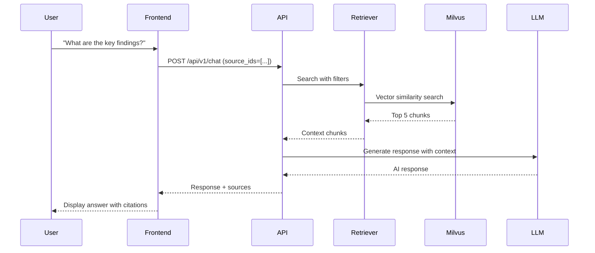

# 🧠 Local Mind

> **Your Personal AI Research Assistant — Fully Local, Fully Private**

Transform your documents into an intelligent knowledge base with AI-powered search and podcast-style audio summaries. No cloud. No API keys. Everything runs on YOUR hardware.


---

## What is Local Mind?

Local Mind is a **privacy-first AI research assistant** that helps you organize, search, and interact with your document collection using advanced vector search and large language models—all running locally on your machine.

### The Problem It Solves

Modern knowledge workers drown in PDFs, research papers, and markdown notes. Traditional search fails because it relies on exact keyword matching. Cloud-based AI solutions expose your private documents to third parties. Local Mind solves both problems:

- **Semantic Search**: Find documents by meaning, not just keywords
- **Privacy-First**: Your data never leaves your machine
- **Multi-Project Organization**: Separate work, research, and personal documents
- **AI-Powered Insights**: Chat with your documents using RAG (Retrieval-Augmented Generation)
- **Automated Summaries**: Get instant briefings on uploaded documents

### When to Use Local Mind

**✅ Perfect For:**
- Researchers managing academic papers
- Developers organizing technical documentation
- Writers collecting reference materials
- Privacy-conscious professionals
- Anyone with 100+ documents to organize

**❌ Not Ideal For:**
- Real-time collaboration (single-user focused)
- Documents requiring OCR (images/scanned PDFs)
- Structured data analysis (use databases instead)

---

## ⚡ Quick Start

Get Local Mind running in under 5 minutes:

```bash
# 1. Clone the repository
git clone https://github.com/your-org/local-mind.git
cd local-mind

# 2. Copy environment configuration
cp .env.example .env

# 3. Start everything (databases + backend + frontend)
sh scripts/init.sh
```

**Expected Output:**
```
✅ Milvus started on port 19530
✅ Redis started on port 6379
✅ Backend API running on http://localhost:8000
✅ Frontend running on http://localhost:3000
```

Open **http://localhost:3000** in your browser. You should see the Local Mind interface.

**Next Steps:**
1. Follow the [Quick Start Tutorial](QUICKSTART.md) for a guided walkthrough
2. Read the [User Guide](USER_GUIDE.md) to learn all features
3. Check [Troubleshooting](docs/TROUBLESHOOTING.md) if you encounter issues

---

## 🏗️ Architecture Overview

Local Mind uses a **pure vector architecture** for fast document processing and retrieval.

### System Components



### Data Flow: Document Upload



### Data Flow: Chat Query



---

## 🎯 Key Features

### 1. Project Isolation (Multi-Tenancy)

Create separate workspaces for different contexts:
- **Work**: Company documents and internal wikis
- **Research**: Academic papers and literature reviews
- **Personal**: Books, articles, and notes

**How it works**: Each project gets a unique ID. All documents, chunks, and queries are filtered by `project_id` at the database level, ensuring strict data boundaries.

### 2. Atomic Deletion ("The Trap" Protocol)

Documents are deleted from the vector database *before* being removed from disk. This prevents "zombie" files that exist on disk but are inaccessible.

**Verification**: If Milvus deletion fails, the file remains on disk for manual recovery. Check `apps/backend/logs/app.log` for `CRITICAL: Failed to delete doc...` messages.

### 3. Vector-First Speed

Uploads process in **under 10 seconds** using pure vector retrieval:
- No graph extraction overhead
- Parallel chunk processing
- Optimized embedding generation

### 4. Automated Briefings

Every uploaded document gets an AI-generated summary including:
- 1-paragraph overview
- 5-7 key topics
- 3 suggested questions to explore

### 5. Source-Filtered Chat

Select specific documents before asking questions. The AI only searches within your selected sources, providing focused answers.

---

## 🧪 Quality & Testing

We operate in **Zero-Tolerance Mode**. Every feature is tested.

```bash
# Backend tests (unit + security)
source venv/bin/activate
pytest tests/

# Frontend E2E tests (Playwright)
cd apps/frontend
npx playwright test
```

**Test Coverage:**
- ✅ **Security**: Project A cannot access files from Project B
- ✅ **Reliability**: Atomic deletion ensures no zombie files
- ✅ **E2E**: Full document lifecycle (upload → search → delete)

---

## 🔧 Prerequisites

| Requirement | Minimum | Recommended | Purpose |
|------------|---------|-------------|---------|
| **Python** | 3.11+ | 3.12+ | Backend runtime |
| **Node.js** | 20+ | 22+ | Frontend build |
| **Docker/Nerdctl** | Latest | Latest | Milvus + Redis |
| **RAM** | 8GB | 16GB+ | Vector operations |
| **GPU** | Optional | NVIDIA/Apple Silicon | Local LLM inference |

**GPU Notes:**
- NVIDIA GPU: Supports CUDA for faster inference
- Apple Silicon: Uses MPS (Metal Performance Shaders) fallback
- CPU-only: Works but slower for LLM operations

---

## 📁 Project Structure

```
local-mind/
├── apps/
│   ├── backend/              # FastAPI (Ingestion, RAG, Multi-tenancy)
│   │   ├── main.py          # API endpoints
│   │   ├── services/        # Business logic
│   │   │   ├── ingestion.py
│   │   │   ├── search.py
│   │   │   └── llm_factory.py
│   │   └── schemas.py       # Pydantic models
│   └── frontend/            # Next.js 15 (UI)
│       ├── app/             # Pages and routing
│       ├── components/      # React components
│       └── store/           # Zustand state management
├── tests/
│   ├── unit/                # Logic verification
│   ├── security/            # Access control tests
│   └── e2e/                 # Full lifecycle automation
├── docs/                    # Extended documentation
│   ├── ARCHITECTURE.md      # Deep-dive system design
│   ├── API_REFERENCE.md     # Complete API docs
│   ├── TUTORIALS.md         # Learning guides
│   └── TROUBLESHOOTING.md   # Problem-solving
├── infrastructure/          # Docker Compose configs
└── scripts/                 # Automation scripts
```

---

## 📚 Documentation

### For Users
- **[Quick Start](QUICKSTART.md)**: Your first 10 minutes with Local Mind
- **[User Guide](USER_GUIDE.md)**: Complete feature walkthrough
- **[Tutorials](docs/TUTORIALS.md)**: Step-by-step learning paths

### For Developers
- **[Developer Guide](DEVELOPER_GUIDE.md)**: Development workflows
- **[Architecture](docs/ARCHITECTURE.md)**: System design deep-dive
- **[API Reference](docs/API_REFERENCE.md)**: Complete API documentation

### For Operators
- **[Operations](OPERATIONS.md)**: Deployment and monitoring
- **[Security](SECURITY.md)**: Hardening and compliance
- **[Deployment](DEPLOYMENT.md)**: Production deployment guide

### Troubleshooting
- **[Troubleshooting Guide](docs/TROUBLESHOOTING.md)**: Common issues and solutions
- **[FAQ](docs/TROUBLESHOOTING.md#faq)**: Frequently asked questions

---

## 🤝 Contributing

We welcome contributions! Please see our [Developer Guide](DEVELOPER_GUIDE.md) for:
- Code style and conventions
- How to add new features
- Testing requirements
- Pull request process

---

## 📄 License

MIT License - see [LICENSE](LICENSE) for details.

---

## 🔗 Resources

- **Documentation**: [Full docs](docs/)
- **Issues**: [GitHub Issues](https://github.com/your-org/local-mind/issues)
- **Discussions**: [GitHub Discussions](https://github.com/your-org/local-mind/discussions)

---

## 🚀 What's Next?

After getting started:
1. **Upload your first documents** - Try PDFs, Markdown, or TXT files
2. **Create projects** - Organize documents by context
3. **Explore chat** - Ask questions about your documents
4. **Pin important insights** - Save valuable AI responses to notes

**Need Help?** Check the [Troubleshooting Guide](docs/TROUBLESHOOTING.md) or [open an issue](https://github.com/your-org/local-mind/issues).
