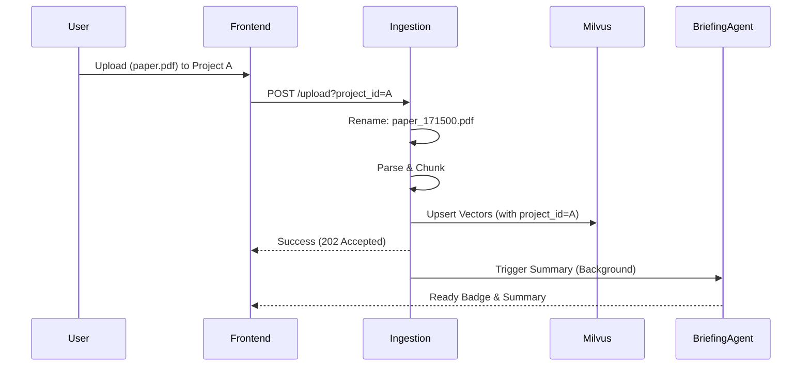

# 🧠 Local Mind

> **Your Personal AI Research Assistant — Fully Local, Fully Private**

Transform your documents into an intelligent knowledge base with AI-powered search and podcast-style audio summaries. No cloud. No API keys. Everything runs on YOUR hardware.


---

## ⚡ One-Command Start

```bash
# Clone the repository
git clone https://github.com/your-org/local-mind.git
cd local-mind

# Copy environment file
cp .env.example .env

# Start everything with a single command
sh scripts/init.sh
```

That's it. Open **http://localhost:3000** when it's ready.

---

## 🏗️ Architecture (V1 Pure Vector)



### Key Features
*   **Project Isolation**: Create multiple projects ("Work", "Personal") with strict data boundaries.
*   **Atomic Deletion**: Documents are deleted from the Vector DB *before* being removed from disk ("The Trap" protocol).
*   **Vector-First Speed**: Uploads process in seconds using pure vector retrieval (No Graph overhead).
*   **Podcast Mode**: Turn any document into a 2-host audio discussion.

---

## 🧪 Quality & Tests

We operate in **Zero-Tolerance Mode**. Every feature is tested.

```bash
# Run the Ironclad Test Suite
make test-backend       # Unit & Security Tests
npx playwright test     # Frontend E2E Lifecycle
```

- **Security**: Tests ensure Project A cannot access files from Project B.
- **Reliability**: Atomic deletion ensures no "zombie" files remain if DB operations fail.

---

## 🔧 Prerequisites

- **Python 3.11+**
- **Node.js 20+**
- **Docker / Nerdctl** (for Milvus/Redis)
- **NVIDIA GPU** (Optional for local inference, supports Apple Silicon via MPS fallback)

---

## 📁 Project Structure

```
local-mind/
├── apps/
│   ├── backend/           # FastAPI (Ingestion, RAG, Multi-tenancy)
│   └── frontend/          # Next.js 15 (Project Sources, Chat, Notes)
├── tests/
│   ├── unit/              # Logic verification (ingest, delete)
│   ├── security/          # Access control tests
│   └── e2e/               # Full lifecycle automation
└── AGENTS.md              # Operational Handbook
```
