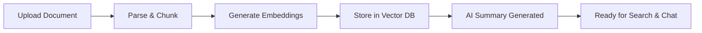
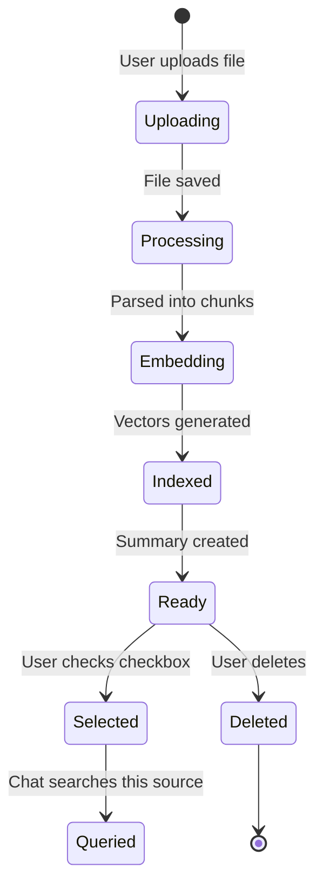

# Local Mind - User Guide

**Your complete guide to mastering Local Mind's features**

This guide explains how to use Local Mind effectively, from basic document management to advanced AI-powered research workflows.

---

## Table of Contents

1. [Core Concepts](#core-concepts)
2. [Getting Started](#getting-started)
3. [Managing Documents](#managing-documents)
4. [Working with Projects](#working-with-projects)
5. [Chat and AI Interaction](#chat-and-ai-interaction)
6. [Notes and Organization](#notes-and-organization)
7. [Advanced Features](#advanced-features)
8. [Tips and Best Practices](#tips-and-best-practices)
9. [Troubleshooting](#troubleshooting)

---

## Core Concepts

### What is Local Mind?

Local Mind is a **privacy-first AI research assistant** that helps you organize and interact with your document collection using semantic search and large language models—all running locally on your machine.

### How It Works



**Key Principles:**
1. **Privacy-First**: Your data never leaves your machine
2. **Semantic Search**: Find documents by meaning, not just keywords
3. **AI-Powered**: Chat with your documents using RAG (Retrieval-Augmented Generation)
4. **Project Isolation**: Separate work, research, and personal documents

### Understanding Projects

**What is a Project?**

A project is a workspace that groups related documents together. Think of it as a folder, but with strict data isolation at the database level.

**Why use Projects?**
- **Separation**: Keep work documents separate from personal research
- **Focus**: Chat queries only search within the current project
- **Organization**: Manage hundreds of documents without clutter

**Example Projects:**
- 🏢 **Work**: Company docs, internal wikis, meeting notes
- 🔬 **Research**: Academic papers, literature reviews
- 📚 **Personal**: Books, articles, learning materials
- 💡 **Ideas**: Brainstorming, creative writing, drafts

### Understanding Sources

**What is a Source?**

A source is a single document you've uploaded to Local Mind. Each source:
- Has a unique ID (e.g., `paper_1734720000.pdf`)
- Belongs to exactly one project
- Is automatically chunked into smaller pieces for search
- Gets an AI-generated summary (briefing)

**Source Lifecycle:**


### Understanding Chunks

**What is a Chunk?**

When you upload a document, Local Mind splits it into smaller pieces called "chunks" (typically 500 tokens each). This enables:
- **Precise retrieval**: Find the exact paragraph that answers your question
- **Context management**: Fit relevant information into the AI's context window
- **Faster search**: Vector search on smaller pieces is more accurate

**Example:**
```
Original Document (10 pages)
    ↓
Chunked into 20 pieces
    ↓
Each chunk gets a vector embedding
    ↓
Chat searches these 20 vectors
    ↓
Top 5 most relevant chunks used as context
```

### Understanding Vector Search

**How does semantic search work?**

Traditional search matches exact keywords. Vector search understands *meaning*:

**Traditional Search:**
- Query: "machine learning algorithms"
- Matches: Documents containing exact phrase "machine learning algorithms"
- Misses: Documents about "neural networks" or "deep learning"

**Vector Search (Local Mind):**
- Query: "machine learning algorithms"
- Matches: Documents about ML, neural networks, deep learning, AI models
- Why: Converts text to mathematical vectors that capture semantic meaning

### Understanding the Briefing Agent

**What is a Briefing?**

After uploading a document, the Briefing Agent automatically generates:
1. **Summary**: 1-paragraph overview
2. **Key Topics**: 5-7 main themes
3. **Suggested Questions**: 3 starting points for exploration

**Why it's useful:**
- Quick preview without reading the entire document
- Discover what's inside before diving deep
- Get conversation starters for chat

**When is it generated?**
- Runs in the background after upload completes
- Takes 5-15 seconds depending on document length
- Appears as a badge on the source card

---

## Getting Started

### The 4-Step Workflow

| Step | Action | How to Do It |
|------|--------|--------------|
| **1. Upload** | Add documents | Click `+ Add` in Sources panel |
| **2. Select** | Choose sources for chat | ☑️ Check the box next to sources |
| **3. Chat** | Ask questions | Type in chat panel |
| **4. Pin** | Save insights | Click 📌 on AI responses |

### Interface Overview

```
┌─────────────────────────────────────────────────────────┐
│  Header: Logo | Project Selector | Theme | Notes | Help │
├──────────┬────────────────────────────┬─────────────────┤
│          │                            │                 │
│ Sources  │   Workspace                │  Notes Panel    │
│ Sidebar  │   (Guide or Chat)          │  (Collapsible)  │
│          │                            │                 │
│ - Upload │   [Content Area]           │  - Quick Notes  │
│ - List   │                            │  - Pinned Msgs  │
│ - Select │                            │                 │
│          │                            │                 │
└──────────┴────────────────────────────┴─────────────────┘
```

**Key UI Elements:**
- **Sources Sidebar (Left)**: Document library and upload
- **Workspace (Center)**: Source Guide or Chat interface
- **Notes Panel (Right)**: Collapsible note-taking area
- **Header**: Navigation and settings

---

## Managing Documents

### Uploading Documents

**Supported Formats:**
- ✅ PDF (`.pdf`)
- ✅ Markdown (`.md`)
- ✅ Plain Text (`.txt`)

**How to Upload:**

1. Click the **`+ Add`** button in the Sources sidebar
2. Select one or more files from your computer
3. Wait for the progress bar to complete (5-30 seconds)
4. Document appears in the sidebar with a timestamp suffix

**Example Filename:**
```
Original: research-paper.pdf
Stored as: research-paper_1734720000.pdf
```

**Why the timestamp?**
- Ensures unique filenames
- Prevents accidental overwrites
- Helps with version tracking

**Upload Limits:**
- **File size**: Up to 100MB per file (configurable)
- **Concurrent uploads**: 5 files at a time
- **Total storage**: Limited by your disk space

**Common Upload Issues:**

| Problem | Solution |
|---------|----------|
| Upload stuck at 50% | Wait up to 30 seconds; check backend logs |
| "Unsupported file type" | Only PDF, MD, TXT supported |
| Upload fails silently | Check backend is running: `curl localhost:8000/health` |

### Viewing Document Details

**How to view a source:**

1. Click the **document title** in the Sources sidebar
2. The workspace switches to "Source Guide" view

**What you'll see:**
- **Summary**: AI-generated overview
- **Key Topics**: Main themes (bullet points)
- **Suggested Questions**: Click to auto-fill chat input

**Example Source Guide:**

```
📄 research-paper_1734720000.pdf

Summary:
This paper explores the application of transformer architectures
in natural language processing, focusing on attention mechanisms
and their impact on model performance.

Key Topics:
• Transformer architecture fundamentals
• Self-attention mechanisms
• BERT and GPT model comparisons
• Fine-tuning strategies
• Benchmark performance results

Suggested Questions:
→ What are the key differences between BERT and GPT?
→ How do attention mechanisms improve NLP models?
→ What benchmarks were used to evaluate performance?
```

### Selecting Sources for Chat

**Why select sources?**

Local Mind only searches within **selected** sources. This gives you:
- **Focused answers**: AI only uses relevant documents
- **Faster responses**: Fewer documents to search
- **Better accuracy**: Reduced noise from unrelated content

**How to select:**

1. **Single source**: Check the box next to one document
2. **Multiple sources**: Check boxes next to several documents
3. **All sources**: (Future feature) Select all in project

**Visual Indicator:**
- ☑️ **Checked**: Source is selected for chat
- ☐ **Unchecked**: Source is ignored in chat

**Pro Tip**: Select 2-5 related documents for comparative questions like "What do these papers agree on?"

### Deleting Documents

**How to delete:**

1. Hover over a source in the sidebar
2. Click the **X** button that appears
3. Confirm deletion (if prompted)

**What gets deleted:**
- ✅ Document file from disk
- ✅ All chunks from vector database
- ✅ AI-generated summary
- ✅ All embeddings

**What's preserved:**
- ❌ Chat history (stays in browser)
- ❌ Pinned notes referencing this source (orphaned)

**⚠️ Deletion is permanent!** There is no undo. Make sure you have backups if needed.

**Atomic Deletion ("The Trap" Protocol):**

Local Mind deletes from the database *before* deleting from disk. This prevents "zombie" files that exist on disk but are inaccessible.

If deletion fails, check logs:
```bash
grep "CRITICAL: Failed to delete" apps/backend/logs/app.log
```

---

## Working with Projects

### Creating Projects

**How to create a project:**

1. Click the **Project Selector** in the header
2. Click **"+ New Project"**
3. Enter a project name (e.g., "Work", "Research")
4. Click **Create**

**Project Naming Tips:**
- Use clear, descriptive names
- Keep it short (1-2 words)
- Use emojis for visual distinction: 🏢 Work, 🔬 Research

### Switching Projects

**How to switch:**

1. Click the **Project Selector** dropdown
2. Select a different project from the list

**What happens:**
- Sources sidebar updates to show only documents in that project
- Chat history is project-specific (not shared across projects)
- All queries only search within the current project

**Data Isolation:**

Projects are **strictly isolated** at the database level. Documents in "Work" project cannot be accessed when viewing "Research" project—even through API calls.

### Organizing with Projects

**Recommended Project Structure:**

```
🏢 Work
   ├── Company policies
   ├── Meeting notes
   └── Internal wikis

🔬 Research
   ├── Academic papers
   ├── Literature reviews
   └── Research notes

📚 Learning
   ├── Tutorial articles
   ├── Course materials
   └── Reference docs

💡 Personal
   ├── Book highlights
   ├── Blog posts
   └── Creative writing
```

**Best Practices:**
- Create projects *before* uploading documents
- Don't create too many projects (3-5 is ideal)
- Use consistent naming conventions
- Archive old projects instead of deleting

---

## Chat and AI Interaction

### Starting a Chat

**How to open chat:**

1. **Option A**: Click a source title, then click "Chat" button
2. **Option B**: Select sources, then click chat icon in header

**Chat Interface:**
- **Input box**: Type your question
- **Send button**: Click or press Enter
- **Quick actions**: Pre-filled prompts (Summarize, Key Questions, Deep Dive)

### Asking Effective Questions

**Good Questions:**
- ✅ "What are the main arguments in this paper?"
- ✅ "How does the author define 'semantic search'?"
- ✅ "Compare the methodologies in these two papers"

**Less Effective:**
- ❌ "Tell me everything" (too broad)
- ❌ "Is this good?" (subjective, needs context)
- ❌ "What's on page 5?" (AI doesn't have page numbers)

**Question Types:**

| Type | Example | Use When |
|------|---------|----------|
| **Summary** | "Summarize the key points" | First time reading |
| **Extraction** | "What are the main findings?" | Looking for specific info |
| **Comparison** | "How do these papers differ?" | Multiple sources selected |
| **Clarification** | "Explain the concept of X" | Need deeper understanding |
| **Application** | "How can I apply this?" | Practical usage |

### Using Quick Actions

**Available Quick Actions:**

1. **📝 Summarize**: "Summarize the key points from this document"
2. **❓ Key Questions**: "What are the most important questions this document raises?"
3. **🔍 Deep Dive**: "Provide a detailed analysis of the main arguments"

**How they work:**
- Click a button to auto-fill the chat input
- Edit the prompt if needed
- Press Enter to send

**Pro Tip**: Use Quick Actions as templates. Modify them for your specific needs.

### Understanding AI Responses

**Response Structure:**
```
[AI Response Text]

Sources:
• Chunk ID: abc123 (Score: 0.89)
• Chunk ID: def456 (Score: 0.85)
```

**What the scores mean:**
- **0.9-1.0**: Highly relevant
- **0.7-0.9**: Relevant
- **<0.7**: Marginally relevant

**Response Quality:**
- **With context**: AI uses your documents to answer
- **Without context**: AI uses general knowledge (may be inaccurate)

**Indicator in response:**
```json
{
  "context_used": true,
  "filtered_sources": true,
  "searched_source_ids": ["abc", "def"]
}
```

### Pinning Important Responses

**Why pin responses?**
- Save valuable insights for later
- Build a knowledge base from AI answers
- Reference across chat sessions

**How to pin:**

1. Hover over an AI response
2. Click the **📌 pin button**
3. Response is saved to Notes panel

**Viewing pinned messages:**

1. Click the **Notes icon** in the header
2. Scroll to "Pinned Messages" section
3. Click to expand and read

**Unpinning:**
- Click the 📌 button again to unpin

---

## Notes and Organization

### Quick Notes

**What are Quick Notes?**

Personal notes you write yourself (not AI-generated). Use for:
- Thoughts and ideas
- To-do items
- Questions to explore later
- Connections between documents

**How to add a note:**

1. Open the **Notes Panel** (click notes icon in header)
2. Click **"+ Add Note"**
3. Type your note
4. Click **Save** or press Ctrl+Enter

**Note Features:**
- **Tags**: Add tags for categorization (e.g., #important, #todo)
- **Timestamps**: Auto-added creation date
- **Search**: Find notes by keyword (future feature)

### Pinned Messages

**What are Pinned Messages?**

AI responses you've saved from chat. These are automatically added when you click the 📌 button.

**Viewing pinned messages:**
- Open Notes Panel
- Scroll to "Pinned Messages"
- Click to expand

**Managing pinned messages:**
- **Unpin**: Click 📌 again in chat
- **Delete**: Click X in Notes Panel
- **Export**: (Future feature) Export to Markdown

### Organizing Notes

**Best Practices:**
- Use **tags** consistently (#work, #research, #idea)
- Pin only the most valuable AI responses
- Review notes weekly to consolidate
- Export important notes to external tools

---

## Advanced Features

### Multi-Document Chat

**What is it?**

Ask questions across multiple documents simultaneously. The AI searches all selected sources and synthesizes information.

**How to use:**

1. Select **2 or more sources** (check boxes)
2. Ask a comparative or synthesis question
3. AI searches all selected documents

**Example Questions:**
- "What do these papers agree on regarding X?"
- "Compare the methodologies used in these studies"
- "Synthesize the main findings across all sources"

**Best Results:**
- Select 2-5 related documents
- Ask specific comparative questions
- Use when documents cover similar topics

### Source-Filtered Search

**What is it?**

Limit search to specific documents instead of the entire project.

**How it works:**
- **No sources selected**: Searches entire project
- **Sources selected**: Searches only those sources

**Use Cases:**
- Focus on recent papers only
- Exclude outdated information
- Compare specific subsets

### Suggested Questions

**What are they?**

AI-generated questions based on document content. Appear in the Source Guide view.

**How to use:**

1. Click a source title to view Source Guide
2. Scroll to "Suggested Questions"
3. Click a question to auto-fill chat input

**Example:**
```
Suggested Questions:
→ What are the key differences between BERT and GPT?
→ How do attention mechanisms improve NLP models?
→ What benchmarks were used to evaluate performance?
```

**Pro Tip**: Use suggested questions as conversation starters, then ask follow-ups.

---

## Tips and Best Practices

### Document Management

**✅ Do:**
- Upload documents in batches (5-10 at a time)
- Use descriptive filenames before uploading
- Create projects before uploading
- Delete outdated documents regularly

**❌ Don't:**
- Upload duplicate documents
- Upload extremely large files (>100MB) without testing
- Mix unrelated documents in one project
- Forget to select sources before chatting

### Effective Searching

**✅ Do:**
- Select relevant sources before asking
- Ask specific, focused questions
- Use Quick Actions as templates
- Pin valuable responses

**❌ Don't:**
- Ask overly broad questions
- Expect AI to know information not in your documents
- Forget which sources are selected
- Rely solely on AI without verifying

### Project Organization

**✅ Do:**
- Create 3-5 focused projects
- Use consistent naming
- Switch projects intentionally
- Archive old projects

**❌ Don't:**
- Create a project for every document
- Mix personal and work documents
- Forget which project you're in
- Delete projects with important data

### Chat Best Practices

**✅ Do:**
- Start with Quick Actions
- Ask follow-up questions
- Pin important insights
- Review sources cited

**❌ Don't:**
- Ask the same question repeatedly
- Ignore source citations
- Expect perfect accuracy
- Forget to verify critical information

---

## Troubleshooting

### Documents Not Appearing

**Problem**: Uploaded document doesn't show in sidebar

**Solutions:**
1. **Refresh the page**: Press F5 or Cmd+R
2. **Check project**: Ensure you're viewing the correct project
3. **Check upload status**: Look for error notifications
4. **Check backend logs**:
   ```bash
   tail -f apps/backend/logs/app.log
   ```

### Chat Not Responding

**Problem**: Chat input doesn't send or returns error

**Solutions:**
1. **Check source selection**: At least one source must be selected
2. **Verify backend**: `curl localhost:8000/health`
3. **Check LLM service**: Ensure Ollama or LM Studio is running
4. **Review browser console**: Press F12, check for errors

### Summary Not Generated

**Problem**: Document uploaded but no summary appears

**Solutions:**
1. **Wait longer**: Summaries take 5-15 seconds
2. **Check document format**: Only PDF, MD, TXT supported
3. **Check backend logs**: Look for "briefing" errors
4. **Retry**: Delete and re-upload the document

### Slow Performance

**Problem**: Chat responses take >10 seconds

**Solutions:**
1. **Reduce selected sources**: Select fewer documents (2-3 max)
2. **Check system resources**: Ensure sufficient RAM/CPU
3. **Use smaller LLM**: Switch to `llama3.2:3b` instead of `8b`
4. **Restart services**: `./start.sh stop && ./start.sh all`

### More Help

For additional troubleshooting:
- **[Troubleshooting Guide](docs/TROUBLESHOOTING.md)**: Comprehensive problem-solving
- **[Developer Guide](DEVELOPER_GUIDE.md)**: Technical debugging
- **[GitHub Issues](https://github.com/your-org/local-mind/issues)**: Report bugs

---

## Keyboard Shortcuts

| Shortcut | Action |
|----------|--------|
| `Enter` | Send message in chat |
| `Shift + Enter` | New line in chat input |
| `Ctrl/Cmd + K` | Focus search (future) |
| `Esc` | Close modals |

---

## Next Steps

**Master Local Mind:**
1. Complete the [Tutorials](docs/TUTORIALS.md) for advanced workflows
2. Read the [Architecture Guide](docs/ARCHITECTURE.md) to understand how it works
3. Explore the [API Reference](docs/API_REFERENCE.md) for programmatic access

**Get Help:**
- **[FAQ](docs/TROUBLESHOOTING.md#faq)**: Common questions
- **[Community](https://github.com/your-org/local-mind/discussions)**: Ask questions
- **[Issues](https://github.com/your-org/local-mind/issues)**: Report bugs

---

**Questions?** Check the [FAQ](docs/TROUBLESHOOTING.md#faq) or [open a discussion](https://github.com/your-org/local-mind/discussions).
