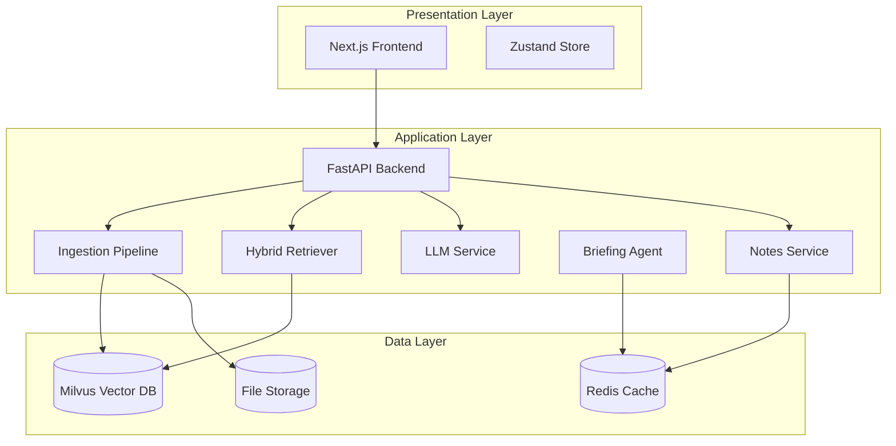
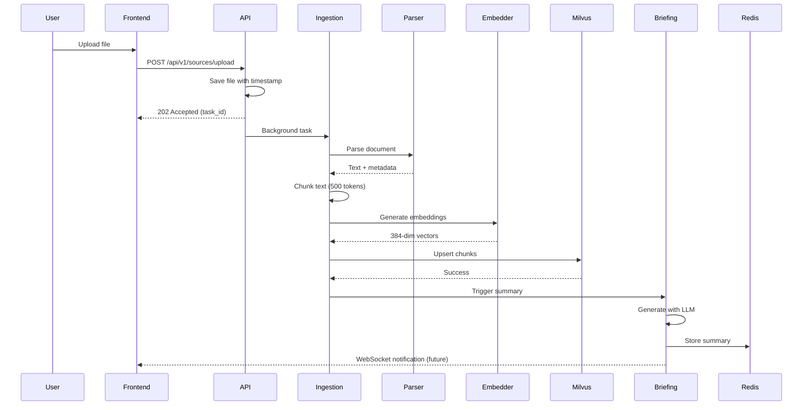
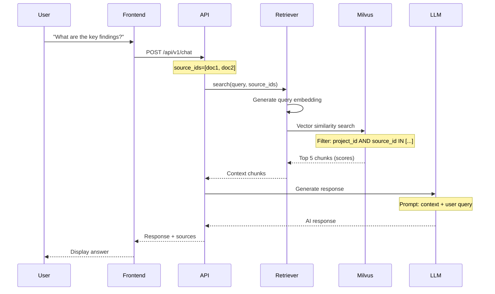
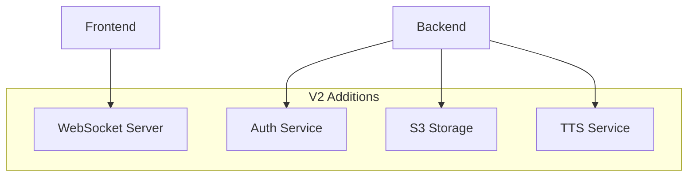

# Local Mind Architecture

**Deep-dive into system design, data flow, and technical decisions**

This document explains how Local Mind works under the hood, the rationale behind key design decisions, and how components interact.

---

## Table of Contents

1. [System Overview](#system-overview)
2. [Component Architecture](#component-architecture)
3. [Data Flow](#data-flow)
4. [Technology Stack](#technology-stack)
5. [Design Decisions](#design-decisions)
6. [Multi-Tenancy Implementation](#multi-tenancy-implementation)
7. [Scalability Considerations](#scalability-considerations)
8. [Architecture Evolution](#architecture-evolution)

---

## System Overview

Local Mind is a **three-tier architecture** with clear separation of concerns:



**Design Principles:**
1. **Privacy-First**: All data stays local, no external API calls for core features
2. **Async-First**: Non-blocking operations for responsive UX
3. **Stateless API**: Backend is stateless for horizontal scalability
4. **Vector-First**: Pure vector architecture for speed (no graph overhead)

---

## Component Architecture

### Frontend (Next.js 15)

**Technology**: React 18 + Next.js 15 App Router + TypeScript

**Key Components:**
```
apps/frontend/
├── app/                    # Next.js App Router
│   └── page.tsx           # Main application page
├── components/
│   ├── panels/
│   │   ├── ChatPanel.tsx      # Chat interface
│   │   ├── SourcesSidebar.tsx # Document list
│   │   ├── SourceGuide.tsx    # Document preview
│   │   └── NotesSidebar.tsx   # Notes panel
│   └── NotebookHeader.tsx     # Top navigation
├── store/
│   └── workspaceStore.ts      # Zustand state management
└── lib/
    └── api.ts                 # API client utilities
```

**State Management (Zustand):**
```typescript
interface WorkspaceStore {
  // Project state
  currentProjectId: string | null
  
  // Source state
  sources: Source[]
  selectedSourceIds: string[]
  activeSourceId: string | null
  
  // UI state
  viewMode: 'guide' | 'chat'
  isNotesOpen: boolean
  
  // Chat state
  pendingChatInput: string | null
  
  // Notes state
  pinnedMessages: PinnedMessage[]
}
```

**Why Zustand?**
- Lightweight (1KB)
- No boilerplate
- TypeScript-first
- Easy to debug

### Backend (FastAPI)

**Technology**: Python 3.11 + FastAPI + Pydantic + Async/Await

**Project Structure:**
```
apps/backend/
├── main.py                 # API endpoints + middleware
├── config.py               # Environment configuration
├── schemas.py              # Pydantic models
├── services/
│   ├── ingestion.py       # Document processing
│   ├── search.py          # Vector search
│   ├── llm_factory.py     # LLM abstraction
│   ├── briefing_service.py # Summary generation
│   ├── notes_service.py   # Notes management
│   └── model_manager.py   # Embedding models
├── routers/
│   ├── system_router.py   # Health checks
│   └── projects_router.py # Project CRUD
├── connection_pool.py      # Database connections
├── circuit_breaker.py      # Fault tolerance
└── metrics.py              # Prometheus metrics
```

**Middleware Stack:**
1. **CORS**: Allow frontend (localhost:3000)
2. **RequestID**: Inject UUID for tracing
3. **Metrics**: Record Prometheus metrics
4. **Exception Handling**: Structured error responses

**Why FastAPI?**
- Native async/await support
- Automatic OpenAPI docs
- Pydantic validation
- High performance (comparable to Node.js)

### Data Layer

**Milvus (Vector Database):**
- Stores document chunks as 384-dimensional vectors
- Supports cosine similarity search
- Handles project-level filtering
- Scales to millions of vectors

**Redis (Cache + Queue):**
- Caches briefing summaries
- Stores notes temporarily
- Future: Task queue for async jobs

**File Storage:**
- Local filesystem (`data/uploads/`)
- Documents stored with timestamp suffix
- Future: S3-compatible object storage

---

## Data Flow

### Document Upload Flow



**Key Steps:**

1. **File Upload** (0-1s)
   - Frontend sends multipart/form-data
   - Backend saves to `data/uploads/`
   - Returns task_id immediately (202 Accepted)

2. **Parsing** (1-3s)
   - PDF: PyMuPDF extracts text
   - Markdown/Text: Direct read
   - Extracts metadata (page count, file size)

3. **Chunking** (1-2s)
   - Split text into 500-token chunks
   - Overlap: 50 tokens between chunks
   - Preserves sentence boundaries

4. **Embedding** (2-5s)
   - Uses `sentence-transformers/all-MiniLM-L6-v2`
   - Generates 384-dimensional vectors
   - Batch processing for efficiency

5. **Storage** (1-2s)
   - Upsert to Milvus collection
   - Includes `project_id` for filtering
   - Atomic operation

6. **Briefing** (5-15s, background)
   - LLM generates summary
   - Extracts key topics
   - Creates suggested questions
   - Cached in Redis

**Total Time**: 5-10 seconds (user-facing), +5-15s (background)

### Chat Query Flow



**Key Steps:**

1. **Query Embedding** (0.1s)
   - Convert user query to 384-dim vector
   - Same model as document embeddings

2. **Vector Search** (0.2-0.5s)
   - Cosine similarity search in Milvus
   - Filter by `project_id` and `source_ids`
   - Return top 5 chunks

3. **Context Assembly** (0.1s)
   - Concatenate chunk texts
   - Add source citations
   - Truncate if exceeds LLM context window

4. **LLM Generation** (1-5s)
   - Prompt template: system + context + query
   - Stream response (future feature)
   - Extract citations

**Total Time**: 2-6 seconds

---

## Technology Stack

### Frontend Stack

| Technology | Version | Purpose |
|-----------|---------|---------|
| **Next.js** | 15.x | React framework with App Router |
| **React** | 18.x | UI library |
| **TypeScript** | 5.x | Type safety |
| **Zustand** | 4.x | State management |
| **Tailwind CSS** | 3.x | Styling (custom CSS used instead) |

### Backend Stack

| Technology | Version | Purpose |
|-----------|---------|---------|
| **Python** | 3.11+ | Runtime |
| **FastAPI** | 0.115+ | Web framework |
| **Pydantic** | 2.x | Data validation |
| **Uvicorn** | 0.30+ | ASGI server |
| **Structlog** | 24.x | Structured logging |

### Data Stack

| Technology | Version | Purpose |
|-----------|---------|---------|
| **Milvus** | 2.4.13 | Vector database |
| **Redis** | 7.x | Cache + queue |
| **etcd** | 3.5.x | Milvus metadata |
| **MinIO** | Latest | Milvus object storage |

### AI/ML Stack

| Technology | Version | Purpose |
|-----------|---------|---------|
| **Sentence Transformers** | 2.x | Embedding generation |
| **Ollama** | Latest | Local LLM runtime |
| **llama3.2** | 3b/8b | Language model |

---

## Design Decisions

### Why Vector-Only (No Graph)?

**Decision**: Use pure vector search instead of hybrid vector+graph.

**Rationale:**
- **Speed**: Vector search is 10x faster than graph extraction
- **Simplicity**: Fewer moving parts, easier to debug
- **Accuracy**: For document search, vectors are sufficient
- **Scalability**: Milvus scales better than Neo4j for this use case

**Trade-offs:**
- ❌ No entity relationship visualization
- ❌ Can't traverse knowledge graph
- ✅ Faster uploads (5-10s vs 30-60s)
- ✅ Simpler architecture

**When to reconsider**: If users need entity extraction or relationship mapping.

### Why Async Background Processing?

**Decision**: Upload returns 202 Accepted immediately, processes in background.

**Rationale:**
- **UX**: User doesn't wait for embedding generation
- **Scalability**: Can queue multiple uploads
- **Fault Tolerance**: Failures don't block UI

**Implementation:**
```python
@app.post("/api/v1/sources/upload", status_code=202)
async def upload_source(
    file: UploadFile,
    background_tasks: BackgroundTasks
):
    task_id = str(uuid.uuid4())
    background_tasks.add_task(process_upload, task_id, file)
    return {"task_id": task_id, "status": "accepted"}
```

**Trade-offs:**
- ❌ More complex error handling
- ❌ Need status polling endpoint
- ✅ Responsive UI
- ✅ Can handle concurrent uploads

### Why Atomic Deletion?

**Decision**: Delete from vector DB *before* deleting from disk.

**Rationale:**
- **Consistency**: Prevents "zombie" files (on disk but not searchable)
- **Debuggability**: If deletion fails, file remains for investigation
- **Safety**: Can manually recover if needed

**Implementation:**
```python
async def delete_document(doc_id: str):
    # 1. Delete from Milvus first
    await milvus.delete(f"doc_id == '{doc_id}'")
    
    # 2. Verify deletion
    results = await milvus.query(f"doc_id == '{doc_id}'")
    if results:
        raise Exception("Deletion verification failed")
    
    # 3. Only then delete file
    os.remove(file_path)
```

**Trade-offs:**
- ❌ Slightly more complex logic
- ✅ No orphaned files
- ✅ Easier debugging

### Why Zustand Over Redux?

**Decision**: Use Zustand for state management instead of Redux.

**Rationale:**
- **Simplicity**: No boilerplate, actions, or reducers
- **Size**: 1KB vs 10KB+ for Redux
- **TypeScript**: First-class TypeScript support
- **Performance**: No unnecessary re-renders

**Example:**
```typescript
// Zustand (simple)
const useStore = create<Store>((set) => ({
  sources: [],
  addSource: (source) => set((state) => ({
    sources: [...state.sources, source]
  }))
}))

// Redux (verbose)
// Need: actions, reducers, types, store config...
```

---

## Multi-Tenancy Implementation

### Project Isolation

**Requirement**: Documents in Project A must not be accessible from Project B.

**Implementation:**

1. **Database Level** (Milvus):
   ```python
   # Insert with project_id
   milvus.insert({
       "doc_id": "abc",
       "project_id": "project-a",
       "text": "...",
       "vector": [...]
   })
   
   # Query with filter
   results = milvus.search(
       vectors=[query_vector],
       filter=f"project_id == '{current_project_id}'"
   )
   ```

2. **API Level**:
   ```python
   @app.get("/api/v1/sources")
   async def list_sources(project_id: Optional[str] = None):
       # Enforce project filter
       sources = await pipeline.get_all_sources(project_id=project_id)
       return {"sources": sources}
   ```

3. **Frontend Level**:
   ```typescript
   // All API calls include project_id
   const response = await fetch(
     `${API_BASE_URL}/api/v1/chat`,
     {
       body: JSON.stringify({
         message: query,
         project_id: currentProjectId
       })
     }
   )
   ```

**Security Test:**
```python
# tests/security/test_isolation.py
def test_project_isolation():
    # Upload to Project A
    doc_a = upload_document(project_id="project-a")
    
    # Switch to Project B
    # Try to access Project A document
    results = search(query="...", project_id="project-b")
    
    # Should NOT find doc_a
    assert doc_a.id not in [r.id for r in results]
```

---

## Scalability Considerations

### Current Limits

| Resource | Limit | Bottleneck |
|----------|-------|------------|
| **Documents** | ~10,000 | Milvus memory |
| **Concurrent Users** | 1 | Single-user design |
| **Upload Size** | 100MB | FastAPI default |
| **Vectors** | ~1M | Milvus standalone |

### Scaling Strategies

**Horizontal Scaling (Backend):**
```bash
# Run multiple backend instances
uvicorn main:app --workers 4 --port 8000
uvicorn main:app --workers 4 --port 8001

# Load balancer (nginx)
upstream backend {
    server localhost:8000;
    server localhost:8001;
}
```

**Vertical Scaling (Milvus):**
```yaml
# Increase Milvus resources
milvus:
  resources:
    limits:
      memory: 16Gi
      cpu: 8
```

**Distributed Milvus:**
```yaml
# For >1M vectors, use Milvus cluster mode
# Separate: query nodes, data nodes, index nodes
```

### Performance Optimization

**Embedding Batch Processing:**
```python
# Instead of one-by-one
for chunk in chunks:
    embedding = embedder.encode(chunk.text)

# Batch process
texts = [c.text for c in chunks]
embeddings = embedder.encode(texts, batch_size=32)
```

**Milvus Index Tuning:**
```python
# Use IVF_FLAT for <100K vectors
# Use IVF_SQ8 for 100K-1M vectors
# Use HNSW for >1M vectors
index_params = {
    "metric_type": "COSINE",
    "index_type": "IVF_FLAT",
    "params": {"nlist": 128}
}
```

---

## Architecture Evolution

### V0: Prototype (Graph-Based)

**Architecture:**
- Neo4j for knowledge graph
- Milvus for vector search
- Hybrid retrieval (vector + graph)

**Problems:**
- Slow uploads (30-60s)
- Complex entity extraction
- Graph visualization unused

### V1: Current (Vector-Only)

**Architecture:**
- Pure vector search
- Milvus only
- Fast uploads (5-10s)

**Improvements:**
- ✅ 6x faster uploads
- ✅ Simpler codebase
- ✅ Easier to debug

### V2: Future (Enhanced)

**Planned Features:**
1. **Streaming Responses**: Real-time LLM output
2. **Multi-User**: Authentication + user isolation
3. **Cloud Sync**: Optional backup to S3
4. **Advanced Search**: Hybrid search with BM25
5. **Podcast Mode**: Text-to-speech summaries

**Architecture Changes:**


---

## Further Reading

- **[API Reference](API_REFERENCE.md)**: Complete API documentation
- **[Developer Guide](../DEVELOPER_GUIDE.md)**: Development workflows
- **[Operations Guide](../OPERATIONS.md)**: Deployment and monitoring

---

**Questions?** [Open an issue](https://github.com/your-org/local-mind/issues) or [start a discussion](https://github.com/your-org/local-mind/discussions).
